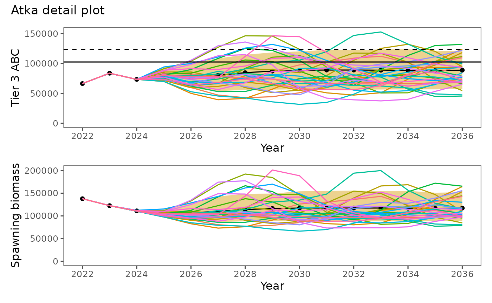
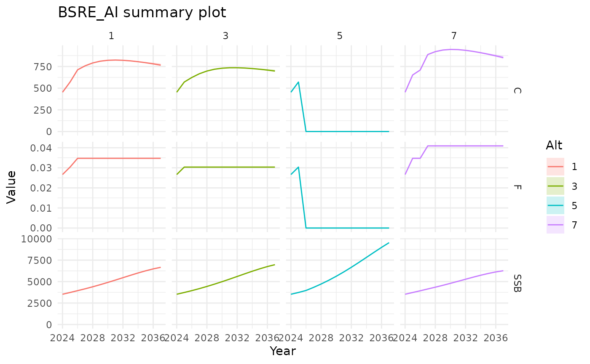

# spmR canonical examples

``` r

library(spmR)
library(readr)
```

This vignette is intentionally limited to two canonical example
directories that are kept in sync with the package:

- `examples/atka` for
  [`runSPM()`](http://afsc-assessments.github.io/spmR/dev/reference/runSPM.md),
  [`dat2list()`](http://afsc-assessments.github.io/spmR/dev/reference/dat2list.md),
  and
  [`plotSPMx()`](http://afsc-assessments.github.io/spmR/dev/reference/plotSPMx.md)
- `examples/BSRE_AI` for
  [`plotSPM()`](http://afsc-assessments.github.io/spmR/dev/reference/plotSPM.md)
  with `spm_summary.csv`

## 1. Atka workflow (`examples/atka`)

Use
[`runSPM()`](http://afsc-assessments.github.io/spmR/dev/reference/runSPM.md)
to read existing ADMB output (`spm_detail.csv`) and inspect inputs using
[`dat2list()`](http://afsc-assessments.github.io/spmR/dev/reference/dat2list.md).

``` r

pkg_root <- if (file.exists("DESCRIPTION")) "." else ".."
atka_dir <- file.path(pkg_root, "examples", "atka")

atka_detail <- runSPM(atka_dir, run = FALSE, engine = "admb")
str(atka_detail)
#> spm_rslt [105,000 × 20] (S3: spm_result/spec_tbl_df/tbl_df/tbl/data.frame)
#>  $ Stock      : chr [1:105000] "Model_16.0b" "Model_16.0b" "Model_16.0b" "Model_16.0b" ...
#>  $ Alt        : num [1:105000] 1 1 1 1 1 1 1 1 1 1 ...
#>  $ Sim        : num [1:105000] 1 1 1 1 1 1 1 1 1 1 ...
#>  $ Year       : num [1:105000] 2022 2023 2024 2025 2026 ...
#>  $ SSB        : num [1:105000] 137805 122551 111309 106528 107685 ...
#>  $ Rec        : num [1:105000] 648 518 358 529 1080 ...
#>  $ Tot_biom   : num [1:105000] 631455 619958 620871 620648 586312 ...
#>  $ SPR_Implied: num [1:105000] 0.517 0.444 0.455 0.413 0.41 ...
#>  $ F          : num [1:105000] 0.372 0.504 0.482 0.576 0.583 ...
#>  $ Ntot       : num [1:105000] 551 514 473 473 483 ...
#>  $ Catch      : num [1:105000] 66481 83800 73495 83297 82317 ...
#>  $ ABC        : num [1:105000] 102578 98592 86706 83297 82317 ...
#>  $ OFL        : num [1:105000] 123759 118791 101474 97783 96860 ...
#>  $ AvgAge     : num [1:105000] 4.73 4.52 4.22 4.06 4.19 ...
#>  $ AvgAgeTot  : num [1:105000] 2.81 2.79 2.97 2.81 2.28 ...
#>  $ SexRatio   : num [1:105000] 0.5 0.5 0.5 0.5 0.5 0.5 0.5 0.5 0.5 0.5 ...
#>  $ B100       : num [1:105000] 280456 280456 280456 280456 280456 ...
#>  $ B40        : num [1:105000] 112182 112182 112182 112182 112182 ...
#>  $ B35        : num [1:105000] 98160 98160 98160 98160 98160 ...
#>  $ Scenario   : chr [1:105000] "1" "1" "1" "1" ...
#>  - attr(*, "spec")=
#>   .. cols(
#>   ..   Stock = col_character(),
#>   ..   Alt = col_double(),
#>   ..   Sim = col_double(),
#>   ..   Year = col_double(),
#>   ..   SSB = col_double(),
#>   ..   Rec = col_double(),
#>   ..   Tot_biom = col_double(),
#>   ..   SPR_Implied = col_double(),
#>   ..   F = col_double(),
#>   ..   Ntot = col_double(),
#>   ..   Catch = col_double(),
#>   ..   ABC = col_double(),
#>   ..   OFL = col_double(),
#>   ..   AvgAge = col_double(),
#>   ..   AvgAgeTot = col_double(),
#>   ..   SexRatio = col_double(),
#>   ..   B100 = col_double(),
#>   ..   B40 = col_double(),
#>   ..   B35 = col_double()
#>   .. )
#>  - attr(*, "problems")=<pointer: 0x561255ac1500>

atka_inputs <- dat2list(file.path(atka_dir, "spm.dat"))
names(atka_inputs)
#>  [1] "rn"               "Tier"             "nalts"            "alts"            
#>  [5] "tac_flag"         "srr_type"         "srr_form"         "srr_conditioning"
#>  [9] "srr_reserved"     "spm_detail_flag"  "nprj_yrs"         "nsims"           
#> [13] "beg_yr"           "nyrs_fixed_catch" "nspp"             "OY_min"          
#> [17] "OY_max"           "datafile"         "ABC_mults"        "scalars"         
#> [21] "alt4_spr"         "nTAC_cat"         "nTACind"          "fixed_catch"
```

Plot detailed simulation trajectories with
[`plotSPMx()`](http://afsc-assessments.github.io/spmR/dev/reference/plotSPMx.md).

``` r

plotSPMx(atka_detail, alt = 2, thisyr = min(atka_detail$Year), mytitle = "Atka detail plot")
```



The experimental RTMB path can also be run from this directory when
`RTMB` is installed.

``` r

runSPM(atka_dir, run = TRUE, engine = "rtmb")
```

## 2. Summary workflow (`examples/BSRE_AI`)

[`plotSPM()`](http://afsc-assessments.github.io/spmR/dev/reference/plotSPM.md)
expects summary-format data (`spm_summary.csv`).

``` r

bsre_dir <- file.path(pkg_root, "examples", "BSRE_AI")
bsre_summary <- read_csv(file.path(bsre_dir, "spm_summary.csv"))
plotSPM(bsre_summary, alt = c(1, 3, 5, 7), mytitle = "BSRE_AI summary plot")
```


